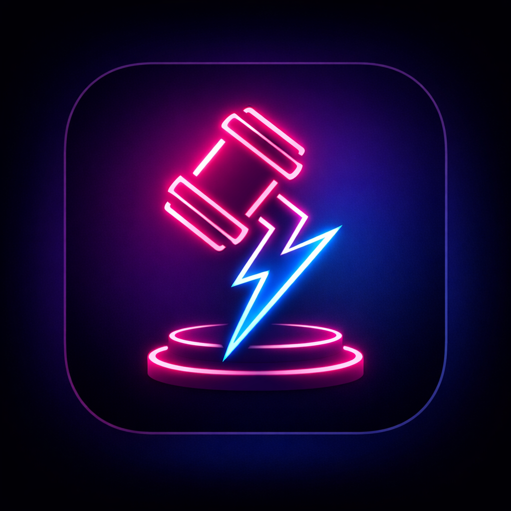

# ⚖️ Verdict - Le Jeu de Jugement Ultime

  

**Verdict** est l'application de soirée qui va révéler ce que vos amis pensent *vraiment* de vous.
Jugez vos potes, révélez des dossiers, et préparez-vous à boire (avec modération).

---

## 📱 Aperçu

| Menu Principal | Le Jeu (Swipe) | Mode Sombre |
|:---:|:---:|:---:|
|  | *Ajoute un screen ici* | *Ajoute un screen ici* |

## ✨ Fonctionnalités

* **Mécanique de Swipe :** Gauche pour *Coupable* (😈), Droite pour *Innocent* (😇).
* **Modes de Jeu :**
    * 😇 **Soft :** Pour briser la glace en douceur.
    * 😈 **Hot :** Pour faire monter la température.
    * ☠️ **Hardcore :** Pour les soirées qui dérapent.
* **Ambiance Immersive :**
    * Animations Lottie (Ange vs Démon).
    * Effets sonores (Marteau de juge, Validation).
    * Retours haptiques (Vibrations) à chaque action.
* **Système Premium :** Achat In-App (simulation) pour débloquer les modes avancés.

## 🛠️ Stack Technique

* **Framework :** [React Native](https://reactnative.dev/) avec [Expo](https://expo.dev/).
* **Navigation :** Expo Router.
* **Design :** StyleSheet, LinearGradient.
* **Animations :** Lottie React Native.
* **Interactions :** React Native Deck Swiper, Expo Haptics, Expo AV (Audio).
* **Stockage :** AsyncStorage (Persistance des données locales).

## 🚀 Installation & Lancement

1.  **Cloner le projet :**
    ```bash
    git clone [https://github.com/TON_NOM_UTILISATEUR/verdict.git](https://github.com/TON_NOM_UTILISATEUR/verdict.git)
    cd verdict
    ```

2.  **Installer les dépendances :**
    ```bash
    npm install
    # ou
    yarn install
    ```

3.  **Lancer le serveur de développement :**
    ```bash
    npx expo start -c
    ```

4.  **Tester :** Scanne le QR code avec l'application **Expo Go** sur ton téléphone.

## 📄 Mentions Légales

Ce jeu est à but humoristique. L'abus d'alcool est dangereux pour la santé.
Consultez notre politique de confidentialité ici : [Lien vers ta page Notion]

---

Made with ❤️ (and a bit of chaos) by **[Ton Prénom]**.